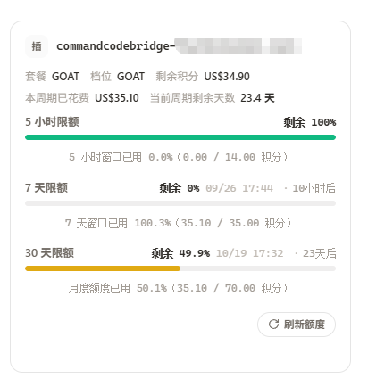

# CommandCodeBridge

CommandCodeBridge 是 [CLIProxyAPI (CPA)](https://github.com/router-for-me/CLIProxyAPI) 的 Command Code 插件。它把 [Command Code](https://commandcode.ai/) 的 API Key 订阅接入 CPA 的凭据系统，提供模型目录、OpenAI 兼容转发、Claude 模型的 Anthropic 协议自动转换、真实 SSE 流与额度上报。首版面向 CLIProxyAPI v7.3.12，发布 Linux amd64/arm64、macOS amd64/arm64 和 Windows amd64 五个平台的动态库。

## 功能

- **API Key 凭据**：Command Code 只使用长期 API Key（Studio 或 `cmd login` 产生，CLI 与 Provider API 共用同一把 key）。可在 CPA 面板或插件控制台发起浏览器登录，也可以直接粘贴。粘贴与登录都会经 `GET /alpha/whoami` 校验有效性并抓取用户名作为默认备注。凭据 ID 由账号派生（`commandcodebridge-<用户名>.json`），名字里能直接看出是哪个账号，**同一账号重复登录或重新粘贴会覆盖同一份凭据**，不会越堆越多。凭据交给 CPA 的 `auth-dir` 保存；插件状态目录不保存凭据。
- **模型目录一键刷新**：`GET /provider/v1/models` 无需鉴权（已实测），返回 81+ 个模型与各自的 `supported_endpoints`。刷新后全部模型可用，无需逐个添加；也支持手动维护别名映射。
- **Claude 模型自动协议转换**：Claude 系模型（`supported_endpoints` 仅含 `/messages`）自动走 Anthropic Messages 端点，插件完成 OpenAI ⇄ Anthropic 的双向转换（含 system、tools、tool_choice、tool_result、thinking/reasoning_content、stop_reason 与 usage 映射，流式与非流式均覆盖）。其余模型直接走 OpenAI 兼容的 `/chat/completions`，零转换。
- **额度上报**：聚合 `whoami` / `billing/credits` / `billing/subscriptions` / `usage/summary` 四个内部接口，展示剩余积分、额外积分、本周期已花费、周期剩余天数，以及 5 小时与 7 天两个滚动窗口的剩余比例（CLI `/usage` 同款数据源）。也可用 `GET /v0/management/commandcodebridge/quota` 直接查看。
- **流式转发**：处理跨网络分块的事件、用量与终止信号；非流式支持 `native`、`native-fallback`、`stream-aggregate` 三种模式，默认 `stream-aggregate`。
- **管理页**：展示凭据、模型映射、请求状态、耗时、用量与尝试记录，界面跟随同源 CPA 主题。

## 鉴权与登录

Command Code 的鉴权只有一种形态：`Authorization: Bearer <API Key>`，key 长期有效，`auth.refresh` 永远返回静态时间。

官方 CLI 的浏览器登录（`https://commandcode.ai/studio/auth/cli`）依赖在本地起 loopback 回调端口接收 key。**授权页只接受 localhost 回调**——callback 填别的地址会直接报 `Invalid Request ... Only localhost URLs are allowed for security`（实证），因此不能指向插件控制台或 CPA 面板；而插件跑在服务器进程里，也监听不了用户本机的端口。于是登录固定走「回环回调 + 复制粘贴」：

1. 发起登录后浏览器打开 `https://commandcode.ai/studio/auth/cli?callback=http://127.0.0.1:41017/callback&mode=redirect&state=…`，确认授权。
2. 浏览器跳到 `http://127.0.0.1:41017/callback?apiKey=…&state=…`——**这个页面打不开是正常的**（本机没有服务在监听）。
3. 把地址栏里的完整 URL，或调试工具里那条请求的 `apiKey=…&state=…` 表单数据，粘贴到插件控制台的「浏览器登录」对话框 →「完成登录」。插件两种形式都能解析，再经 `GET /alpha/whoami` 校验后保存。

两个入口共用同一套会话（`loginSessions`），所以从哪发起都行：

| 入口 | 行为 |
|---|---|
| CPA 面板的「开始 CommandCodeBridge 登录」（宿主 `auth.login.start/poll`） | 打开授权页；面板随后一直显示「等待认证」，直到在插件控制台粘贴回调 URL，由**宿主**在轮询成功时把凭据写入 `auth-dir` |
| 插件控制台的「凭据」→「浏览器登录」 | 同一个对话框里既打开授权页也粘贴回调 URL，凭据由插件自己保存 |

**注意**：面板上的「回调 URL」表单（提交到宿主 `/v0/management/oauth-callback`）对 Command Code 不可用——宿主的处理函数只认 `code` 参数，而 Command Code 回传的是 `apiKey`，一律返回 400。回调 URL 只能粘到插件控制台。

直接粘贴 API Key 跳过浏览器登录同样可用（Studio：<https://commandcode.ai/studio> 的 API Keys 页生成）。

## 额度

额度来自四个内部只读接口（CLI 1.65.2 逆向确认，`/usage` 命令同款调用序列），全部以同一枚 API Key 访问：

| 接口 | 用途 |
|---|---|
| `GET /alpha/whoami?limits=1` | 用户与组织（orgId） |
| `GET /alpha/billing/credits[?orgId=]` | 剩余积分（monthly + purchased + free）与 `windowLimits` |
| `GET /alpha/billing/subscriptions[?orgId=]` | 套餐（planId）、当前周期 |
| `GET /alpha/usage/summary[?orgId=][&since=]` | 周期内已花费（totalCost） |

注意各接口没有统一信封：credits 包了一层 `credits`、subscriptions 包了一层 `data`，whoami 与 summary 是平铺对象。**`windowLimits` 与 `credits` 平级**（不在 `credits` 里面，这是实测复核过的形状）；套餐 `planId` 只出现在 `subscriptions.data.planId`。`windowLimits.fiveHour/weekly` 的 `used`/`cap` 是积分（1 积分 ≈ 1 美元用量），`resetAt` 是 epoch 毫秒（CLI 直接与 `Date.now()` 比较）。

`orgId` 是可选参数：个人账户的 `whoami` 返回 `"org": null`，此时**必须不带** `orgId`（带上空值会返回 400 `Invalid UUID at "orgId"`）；只有组织账户才带。

窗口以额度桶（bucket）形式上报，`remainingFraction = 1 - used/cap`，取值 **0~1 的小数**（不是百分数）。**宿主会丢弃没有有效 `remainingFraction` 的桶**，所以这个字段不能省。`windowLimits.limited` 为 false（按量付费）时不报滚动窗口桶，只报余额，整体不失败。

上报三个窗口，与官方 CLI `/usage` 的 Usage Limits 一一对应：

| 窗口 | token | 已用 | 上限 | 复位时间 |
|---|---|---|---|---|
| 5 小时 | `five_hour` | `windowLimits.fiveHour.used` | `windowLimits.fiveHour.cap` | `resetAt`（epoch 毫秒） |
| 7 天 | `seven_day` | `windowLimits.weekly.used` | `windowLimits.weekly.cap` | `resetAt`（epoch 毫秒） |
| 月度 | `monthly` | `summary.totalMonthlyCredits`（缺失时退回 `totalCost`） | **已用 + `credits.monthlyCredits`** | `subscriptions.data.currentPeriodEnd` |

月度上限是**还原**出来的：上游在 `windowLimits` 里只给两个滚动窗口，月额度只暴露"剩余"（`credits.monthlyCredits`），所以上限 = 剩余 + 本周期已用（实测两数相加正好等于整份月额度，测试里用脱敏后的等价数值 28.5 + 21.5 = 50 固定这条行为）。

桶的 `description` 刻意用**已用**口径（如 `月度额度已用 43.0%（21.50 / 50.00 积分）`），与官方 CLI 显示的数字一致；`remainingFraction` 仍是"剩余"比例，这是宿主的字段语义。

`quota.reset` 一律返回失败，因为 Command Code 未提供重置额度的接口。

### 在管理面板里查看（注意面板版本）

插件按 CPA 的额度能力上报（`quota_provider: true`），宿主侧完整支持。但**官方管理面板目前不支持插件额度**——它把额度分派写死在 7 个内置厂商上，没有插件分支（最新版 v1.24.2 实测同样如此）。因此在**未打补丁**的面板上，凭据卡片上不会出现额度区块，也不会报错。

两条路：

1. **不依赖面板**：直接 `GET /v0/management/commandcodebridge/quota`，或打开控制台页面查看。
2. **让面板显示**：给管理面板套用**插件额度补丁**（加一个通用适配器去接宿主的 `/quota/fetch`），
   卡片上即出现「点击此处刷新额度」，配额管理页也会多出「插件」分组。
   补丁与完整步骤见 **PanelPluginQuota** 仓库：<https://github.com/StarzL1kerain/PanelPluginQuota>
   （含源码补丁、构建好的 `management.html`（可直接部署，无需 Node）、部署脚本与排错说明）。

> 补丁**只改面板那个 `management.html` 静态文件，不涉及 CPA 本体**；不打它插件依然可用，只是面板上看不到额度。
> 官方面板 v1.24.2 已实测确认没有插件分支，**更新面板解决不了**。
> 补丁后注意两点：`disable-auto-update-panel` 必须为 `true`（否则面板自动更新会覆盖补丁），换完要硬刷新浏览器
> （CPA 不给面板发 `Cache-Control`，普通 F5 可能无效）。

补丁版面板会把 `window` token 翻译成标签，识别 `five_hour` / `weekly` / `seven_day` / `monthly`。换到 Command Code 无需再改面板。

打上补丁后的实际效果（套餐、余额、本周期已花费、周期剩余天数，以及 5 小时 / 7 天 / 月度三个窗口）：



## 安装

需要 CLIProxyAPI v7.3.12 或兼容的插件 ABI，且宿主的 `plugins.enabled` 为 `true`。

**本插件不在内置的官方市场里** —— CPA 的内置市场只收录官方插件，所以安装它只有两条路：给 CPA 追加一个市场源，或者直接手动安装。

### 方式一：追加市场源

在 CPA 配置里加上本仓库的市场源（其余字段按现有配置合并）：

```yaml
plugins:
  enabled: true
  dir: plugins
  store-sources:
    - https://raw.githubusercontent.com/StarzL1kerain/CommandCodeBridge/main/marketplace/registry.json
```

内置的官方市场始终保留，`store-sources` 只是追加一个来源。加上之后在 CPA 的插件市场里搜 **CommandCodeBridge** 即可安装，安装完会自动写入 `plugins.configs.commandcodebridge`。

> 这条路要求宿主机能访问 `raw.githubusercontent.com`（读 registry）与 `github.com`（下 Release 资产）。两种常见失败：
> 网络抖动时 `/v0/management/plugin-store` 会超时或 502；商城解析"最新 Release"要走 GitHub API，未鉴权时**每个出口 IP 每小时只有 60 次**配额，
> 容易撞上 `GitHub API rate limited`。这两种情况都用手动方式绕开即可；或给 CPA 配 `proxy-url` 走代理。

### 方式二：手动安装（离线，网络不稳时推荐）

1. 在本仓库的 Releases 里下载宿主平台对应的 ZIP：`commandcodebridge_<version>_<goos>_<goarch>.zip`（linux/darwin/windows 共五个平台，版本与 tag 一致）。
2. 用同 Release 的 `checksums.txt` 核验 ZIP 的 SHA-256。
3. 解压 —— ZIP 根目录直接就是动态库：`commandcodebridge.so`（Linux）、`commandcodebridge.dylib`（macOS）、`commandcodebridge.dll`（Windows）。
4. 放进 CPA 的插件目录：`plugins/`，或按平台分目录 `plugins/<GOOS>/<GOARCH>/`。文件名可以带版本（如 `commandcodebridge-v0.1.1.so`），宿主会据此解析出版本号；插件 ID 始终是 `commandcodebridge`。
5. 确认配置里已启用：

```yaml
plugins:
  enabled: true
  dir: plugins
  configs:
    commandcodebridge:
      enabled: true
      priority: 10
```

6. 重启 CPA，或通过管理接口让它重新加载动态库。

**验证**：`GET /v0/management/plugins`（需管理密钥）里该插件应显示 `registered: true` 与 `effective_enabled: true`。注意别混用三个状态字段：`plugins_enabled` 是全局开关、`enabled` 是单个插件开关、`registered` 才是动态库已加载；三者都满足才是真正生效。

### 打开控制台

插件加载后打开：

```text
/v0/resource/plugins/commandcodebridge/console
```

页面优先复用同源 CPA 管理中心通过“记住密码”保存的登录信息，并核对其服务器地址。未保存登录信息、存储不可用或管理中心跨域时，才提示输入 **CPA 管理密钥**；手动输入的密钥仅保存在当前页面内存。插件不会额外持久化管理密钥。CPA 的管理 API 必须已启用；接口鉴权仍由 CPA 控制。进入页面后点“添加凭据”，粘贴 Command Code API Key，再刷新或选择模型。

插件配置与请求记录默认写在 `plugins/commandcodebridge-data`；凭据文件写在 CPA 配置的 `auth-dir`。使用容器时，应分别持久化这两个目录及插件目录。备份时也应覆盖这两处数据。

## 模型与路由

客户端调用 CPA 的 OpenAI 兼容接口时使用模型名即可。默认映射 `deepseek-v4-flash` → `deepseek/deepseek-v4-flash`、`deepseek/deepseek-v4-flash` → 同名、`claude-sonnet-5` → 同名；在管理页“模型映射”里可一键刷新目录获取全部模型，或手动添加别名。

```json
{
  "model": "claude-sonnet-5",
  "messages": [{"role": "user", "content": "你好"}],
  "stream": true
}
```

路由规则（依据目录 `supported_endpoints`，未知模型按 `claude` 前缀兜底）：

| 端点 | 模型 | 说明 |
|---|---|---|
| `POST /provider/v1/chat/completions` | DeepSeek、Qwen、Gemini、GPT 等 | OpenAI 兼容，直接转发 |
| `POST /provider/v1/messages` | Claude 系（如 `claude-sonnet-5`） | 插件自动做 OpenAI ⇄ Anthropic 转换 |

Claude 模型不能发给 `/chat/completions`（上游返回 400），这是路由转换存在的原因。thinking 块映射为 `reasoning_content`，工具调用增量在流式下逐块翻译为 OpenAI `tool_calls` 分片，聚合逻辑与其他模型共用。

日志中的实际 provider 来自上游响应显式 `provider` 字段；未回报时显示“未知”，不猜测。

非流式三种模式用于应对偶发空内容，推荐的 `stream-aggregate` 从第一次请求就使用流式上游，客户端仍收到非流式 JSON；它不会消除上游本身的错误。可选的 `native-fallback` 可能产生第二次上游请求。SSE 一旦开始向客户端输出，就不进行透明重试。上游错误、订阅额度与模型可用性仍由 Command Code 决定。

CPA v7.3.12 的 Chat Completions 流式接口由宿主封装 SSE，插件提交原始 JSON 并由宿主发送结束标记。标准 `/v1/messages` 路由的 Claude 转换器要求 SSE 输入，插件依据宿主传入的 `request_path` 适配。

## 从源码构建

项目使用 Go 1.26、标准 C ABI 和 `gopkg.in/yaml.v3`。在仓库根目录执行：

```bash
docker build --platform linux/amd64 -f Dockerfile.build --output type=local,dest=dist .
```

构建阶段使用 `golang:1.26-bookworm`，并以 `CGO_ENABLED=1`、`-buildmode=c-shared` 编译 `./cmd/codecbridge`。输出 `dist/commandcodebridge.so`，目标为 Debian 12 兼容的 Linux amd64 动态库。

[构建工作流](.github/workflows/release.yml) 在普通 push 和 PR 中分别测试并构建五个平台：Linux amd64 使用 Debian 12 Docker 构建，Linux arm64 在 `ubuntu-24.04-arm` 上使用同一 Go 镜像；macOS amd64/arm64 使用原生 `macos-15-intel`/`macos-15`；Windows amd64 使用 `windows-latest` 和 MSYS2 UCRT64 GCC。只有推送与源码版本一致的 `v<version>` 标签且五个作业全部通过时，工作流才汇总发布五个 ZIP 与统一的 `checksums.txt`。资产命名遵循 [CPA 官方插件市场规范](https://github.com/router-for-me/CLIProxyAPI-Plugins-Store#release-requirements)。

市场 registry 使用 CPA v7.3.12 的 `schema_version: 1`、`github-release` 安装类型。它是 CPA 商店入口，不是一个可直接安装的 `.so` URL；若使用自己的市场源，也必须托管符合该 schema 的 JSON registry，并提供对应 GitHub Release 资产。

## 版本与开发记录

本文档描述 **v0.1.1** 的功能集。v0.1.1 相对 v0.1.0 的改动：浏览器登录落地（宿主 `auth.login.start/poll` + 回环回调手动粘贴）、额度口径修正（`windowLimits` 与 `credits` 平级、新增月度窗口、`orgId` 可选）、凭据按账号命名、`/alpha` 请求自动重试、`/alpha` 抖动容错，以及注册元数据补上 `Logo`。

Command Code 侧的实证事实（Provider API 形状、`/alpha/*` 用量接口、登录流程、错误信封）由官方文档、`command-code` npm 包 1.65.2 逆向与无鉴权实测交叉确认：

- Provider API：`https://api.commandcode.ai/provider/v1`，OpenAI 兼容，`/models` 无鉴权。
- 错误信封：`{"success":false,"error":{"code","status","message"}}`（401 实测样例）。
- `GET /provider/v1/models` 的 `supported_endpoints` 决定模型端点：Claude 系仅 `/messages`，多数模型为 `/chat/completions,/responses`。

宿主契约与开发方法论整理在 `docs/` 下（与插件仓库同级）：

| 文档 | 内容 |
|---|---|
| [`docs/README.md`](../docs/README.md) | 索引与一页速查（新增供应商四阶段） |
| [`docs/01-宿主契约-CPA插件ABI.md`](../docs/01-宿主契约-CPA插件ABI.md) | 能力键、方法分派、登录/额度/管理 API 的字段级契约 |
| [`docs/02-开发手册-新增供应商.md`](../docs/02-开发手册-新增供应商.md) | 四阶段 checklist、安全基线、验收清单 |

> `docs/` 目前位于插件仓库同级目录。若要随仓库一起发布，把它移入仓库根目录即可，上表中的相对链接无需改动。

## 许可与来源

本项目按 [MIT License](LICENSE) 发布。CommandCodeBridge 为独立实现，从 [ClinePassBridge](https://github.com/StarzL1kerain/ClinePassBridge) 的已验证宿主适配层演进而来；Command Code 侧行为全部自行实证，未复制任何官方代码。Command Code 与 CLIProxyAPI 分别由各自项目维护。
